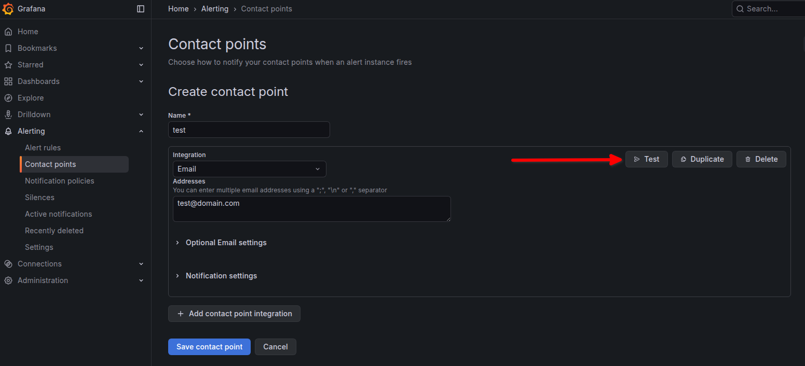
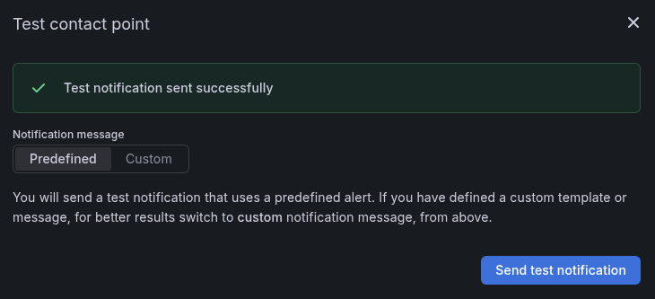

## Pre-deployment:

1. Create new kube-prometheus-stack namespace

```
kubectl create namespace kube-prometheus-stack
```

2. Create PersistentVolume (PV)

Save as grafana-pv.yaml

```
apiVersion: v1
kind: PersistentVolume
metadata:
  name: grafana-pv
spec:
  capacity:
    storage: 5Gi
  accessModes:
    - ReadWriteOnce
  persistentVolumeReclaimPolicy: Retain
  storageClassName: ""
  local:
    path: /data/grafana
  nodeAffinity:
    required:
      nodeSelectorTerms:
      - matchExpressions:
        - key: kubernetes.io/hostname
          operator: In
          values:
          - <NODE_NAME>
```

3. Apply it

```
kubectl apply -f grafana-pv.yaml
```

4.  Verify

```
kubectl get pv
```

5. Create PersistentVolumeClaim (PVC)

Save as grafana-pvc.yaml

```
apiVersion: v1
kind: PersistentVolumeClaim
metadata:
  name: grafana-pvc
  namespace: kube-prometheus-stack
spec:
  accessModes:
    - ReadWriteOnce
  resources:
    requests:
      storage: 5Gi
  storageClassName: ""
  volumeName: grafana-pv
```

6. Apply it

```
kubectl apply -f grafana-pvc.yaml
```

7.  Verify

```
kubectl get pvc -n kube-prometheus-stack
```

Status should be **Bound**

8. Create local user and group for Grafana container

Grafana community version runs as UID=472 GID=472 enforced by Helm chart

That overrides image defaults to ensure non-root operation

```
[Reference]
...
 ...
  securityContext:
    fsGroup: 472
    runAsGroup: 472
    runAsNonRoot: true
    runAsUser: 472
  ...
...    
```
Having 472:472 locally and defined explicitly for /data/grafana, may help
```
sudo groupadd --system --gid 472 grafana
sudo useradd --system -M -g 472 --uid 472 --no-log-init grafana
```
9. Run on node that will host Grafana

```
sudo mkdir -p /data/grafana
sudo chown -R 472:472 /data/grafana
sudo chmod 755 /data/grafana
```

## Deployment

1. Add and or update Helm repository

```
helm repo add prometheus-community https://prometheus-community.github.io/helm-charts

helm repo update
```

2. Select target Kubernetes cluster

```
kubectl config use-context <target-cluster-context>
```

Verify with

```
kubectl config current-context
```

4. Create Kubernetes Secret for **your unique** SMTP user and password

```
kubectl create secret generic grafana-smtp-secret \
  --namespace kube-prometheus-stack \
  --from-literal=GF_SMTP_USER="example@domain.com" \
  --from-literal=GF_SMTP_PASSWORD="yOur PaSs wORd HerE"
```

Verify with

```
kubectl get secret grafana-smtp-secret -n kube-prometheus-stack

kubectl describe secret grafana-smtp-secret -n kube-prometheus-stack
```

5. Create Kubernetes Secret for Grafana admin user

```
kubectl create secret generic grafana-admin-secret \
  -n kube-prometheus-stack \
  --from-literal=admin-user=admin \
  --from-literal=admin-password='YourOwnStrongPasswordHere'
```

Verify with

```
kubectl get secret grafana-admin-secret -n kube-prometheus-stack

kubectl describe secret grafana-admin-secret -n kube-prometheus-stack
```

5.  Create values-grafana.yaml file using your SMTP host and address

```
grafana:
  
  env:
    GF_SMTP_ENABLED: "true"
    GF_SMTP_HOST: "smtp.domain.com:587"
    GF_SMTP_FROM_ADDRESS: "example@domain.com"
    GF_SMTP_FROM_NAME: "Grafana Alerts"
    GF_SMTP_SKIP_VERIFY: "true"
    GF_DATE_FORMATS_DEFAULT_TIMEZONE: browser
    GF_FEATURE_TOGGLES_ENABLE: ""

  envFromSecret: grafana-smtp-secret

  service:
    type: NodePort
    nodePort: <available port e.g. 32000>

  admin:
    existingSecret: grafana-admin-secret
    userKey: admin-user
    passwordKey: admin-password
 
  nodeSelector:
    kubernetes.io/hostname: <node to host Grafana Persistent Storage>
    
  persistence:
    enabled: true
    existingClaim: grafana-pvc
    mountPath: /var/lib/grafana
  
  initChownData:
    enabled: false
``` 

6. Install Prometheus & Grafana with SMTP Enabled

```
helm install kube-prometheus-stack prometheus-community/kube-prometheus-stack \
  --namespace kube-prometheus-stack \
  -f values-grafana.yaml
```

[Optional] Watch pods and deployment create

```
kubectl get pods -n kube-prometheus-stack -w

kubectl rollout status deployment kube-prometheus-stack-grafana -n kube-prometheus-stack

kubectl exec -n kube-prometheus-stack deploy/kube-prometheus-stack-grafana -- env | grep GF_SMTP

kubectl -n kube-prometheus-stack get pods -l release=kube-prometheus-stack
```

All pods should be in Running state.

7. Verify Grafana SMTP Configuration (Authoritative Check)

```
kubectl exec -n kube-prometheus-stack \
  deploy/kube-prometheus-stack-grafana \
  -- env | grep GF_SMTP
```

Expected output includes:
```
GF_SMTP_SKIP_VERIFY=true
GF_SMTP_ENABLED=true
GF_SMTP_HOST=smtp.domain.com:587
GF_SMTP_PASSWORD=yOur PaSs wORd HerE
GF_SMTP_USER=example@domain.com
GF_SMTP_FROM_ADDRESS=example@domain.com
GF_SMTP_FROM_NAME=Grafana Alerts
```
8. Access Grafana UI

```
http://<any-node-ip>:<nodePort>
```

Log in using the admin credentials

9. Validate SMTP Functionality

Navigate to:
Home → Alerting → Contact points

Create a new Email contact point

Click Test

Confirm the test email is successfully delivered



